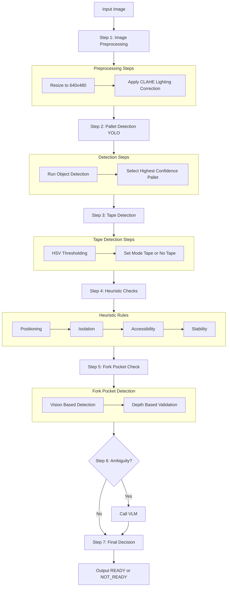

## Question 3 - Step-by-Step Solution Flow

### Approach



---

## Step 1 - Image Preprocessing

Goal: Normalize the input for stable detection

* Resize image (640×480)
* Apply lighting correction (CLAHE)

**Code Logic**

```python
frame = cv2.resize(frame, (640, 480))

lab = cv2.cvtColor(frame, cv2.COLOR_BGR2LAB)
l, a, b = cv2.split(lab)

clahe = cv2.createCLAHE(clipLimit=2.0, tileGridSize=(8,8))
l = clahe.apply(l)

frame = cv2.merge((l, a, b))
frame = cv2.cvtColor(frame, cv2.COLOR_LAB2BGR)
```

---

## Step 2 - Pallet Detection (YOLO)

Goal: Locate the pallet in the image

* Run object detection
* Select pallet with highest confidence

**Code Logic**

```python
results = model(frame)[0]

pallet_bbox = None
for box in results.boxes:
    if int(box.cls[0]) == PALLET_CLASS and box.conf[0] > 0.65:
        pallet_bbox = box.xyxy[0]
        break
```

---

## Step 3 - Tape Detection

Goal: Identify if staging tape is present

* Use HSV color thresholding
* Set mode: tape or no-tape

**Code Logic**

```python
hsv = cv2.cvtColor(frame, cv2.COLOR_BGR2HSV)
mask = cv2.inRange(hsv, lower_blue, upper_blue)

tape_present = np.sum(mask > 0) > threshold
```

---

## Step 4 - Apply 4 Heuristic Rules

Goal: Check readiness conditions

* Positioning
* Isolation
* Accessibility
* Stability

---

## Step 5 - Fork Pocket Check

Goal: Ensure physical pickup is possible

* Detect pockets via vision / depth

---

## Step 6 - Ambiguity Handling (VLM)

Goal: Resolve uncertain cases

* If rules are unclear then call VLM
* Otherwise skip VLM

**Code Logic**

```python
if not all([positioning_pass, isolation_pass, accessibility_pass, stability_pass]):
    if is_borderline_case():
        vlm_result = call_vlm(frame_crop)
```

---

## Step 7 - Final Decision

Goal: Output READY or NOT_READY
